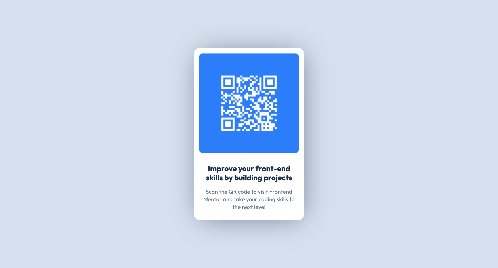

# Frontend Mentor - QR code component solution

This is a solution to the [QR code component challenge on Frontend Mentor](https://www.frontendmentor.io/challenges/qr-code-component-iux_sIO_H). Frontend Mentor challenges help you improve your coding skills by building realistic projects. 

## Table of contents

- [Overview](#overview)
  - [Screenshot](#screenshot)
  - [Links](#links)
- [My process](#my-process)
  - [Built with](#built-with)
  - [What I learned](#what-i-learned)
  - [Useful resources](#useful-resources)
- [Author](#author)


## Overview

### Screenshot



### Links

- Solution URL: [Add solution URL here](https://your-solution-url.com)
- Live Site URL: [Add live site URL here](https://your-live-site-url.com)

## My process

### Built with

- Semantic HTML5 markup
- CSS custom properties
- Flexbox
- Media Queries
- Mobile-first workflow

### What I learned
   I'm very proud of my adept knowledge in the code below:

```css
.proud-of-this-css {
  display:flex;
  flex-direction: column;
  @media (min-width: 1440px);
}
```

### Useful resources

- [Resource 1](https://www.w3school.com) 
- [Resource 2](https://www.chatgpt.com)

## Author

- Website - [Github](https://github.com/lola-ilori)
- Frontend Mentor - [@Lola](https://www.frontendmentor.io/profile/lola)
- Twitter - [@code_nerdette](https://www.twitter.com/Code_Nerdette)

